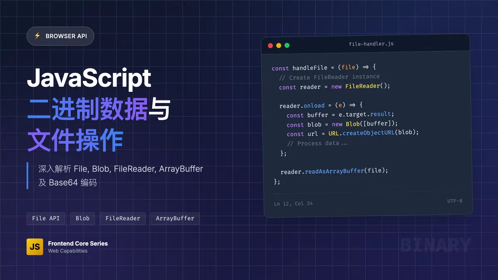

# File、Blob、FileReader、ArrayBuffer、Base64、 Object URL



## 概述

在现代 Web 开发中，处理文件和二进制数据是一个常见需求。JavaScript 提供了多种 API 来处理这些数据类型，每种都有其特定的用途和优势。本文档将详细介绍这些重要的 Web API。

## File 对象

### 定义

File 对象是 Blob 对象的一个特殊类型，表示用户选择的文件。它继承了 Blob 的所有属性和方法，并添加了一些文件特有的属性。

### 主要属性

- `name`: 文件名
- `size`: 文件大小（字节）
- `type`: 文件的 MIME 类型
- `lastModified`: 文件最后修改时间（时间戳）
- `lastModifiedDate`: 文件最后修改日期（Date 对象）

### 获取 File 对象的方式

#### 1. 通过 input 元素

```html
<input type="file" id="fileInput" multiple>
```

```javascript
const fileInput = document.getElementById('fileInput');
fileInput.addEventListener('change', (event) => {
  const files = event.target.files;
  for (let i = 0; i < files.length; i++) {
    const file = files[i];
    console.log('文件名:', file.name);
    console.log('文件大小:', file.size);
    console.log('文件类型:', file.type);
  }
});
```

#### 2. 通过拖拽 API

```javascript
const dropZone = document.getElementById('dropZone');

dropZone.addEventListener('dragover', (e) => {
  e.preventDefault();
});

dropZone.addEventListener('drop', (e) => {
  e.preventDefault();
  const files = e.dataTransfer.files;
  // 处理文件
});
```

## Blob 对象

### 定义

Blob（Binary Large Object）对象表示不可变的、原始数据的类文件对象。它可以包含任意类型的数据，不仅限于 JavaScript 原生格式。

### 构造函数

```javascript
const blob = new Blob(array, options);
```

- `array`: 包含数据的数组（可以是字符串、ArrayBuffer、ArrayBufferView、Blob 等）
- `options`: 可选配置对象
    - `type`: MIME 类型
    - `endings`: 行结束符处理方式

### 示例用法

#### 创建文本 Blob

```javascript
const textBlob = new Blob(['Hello, World!'], { type: 'text/plain' });
console.log(textBlob.size); // 13
console.log(textBlob.type); // 'text/plain'
```

#### 创建 JSON Blob

```javascript
const data = { name: 'John', age: 30 };
const jsonBlob = new Blob([JSON.stringify(data)], { type: 'application/json' });
```

#### 合并 Blob

```javascript
const blob1 = new Blob(['Hello ']);
const blob2 = new Blob(['World!']);
const combinedBlob = new Blob([blob1, blob2]);
```

### Blob 方法

#### slice() 方法

```javascript
const blob = new Blob(['Hello, World!']);
const slicedBlob = blob.slice(0, 5); // 'Hello'
```

#### stream() 方法

```javascript
const blob = new Blob(['Hello, World!']);
const stream = blob.stream();
const reader = stream.getReader();
```

#### text() 方法

```javascript
const blob = new Blob(['Hello, World!']);
blob.text().then(text => {
  console.log(text); // 'Hello, World!'
});
```

#### arrayBuffer() 方法

```javascript
const blob = new Blob(['Hello, World!']);
blob.arrayBuffer().then(buffer => {
  console.log(new Uint8Array(buffer));
});
```

## FileReader 对象

### 定义

FileReader 对象允许 Web 应用程序异步读取存储在用户计算机上的文件（或原始数据缓冲区）的内容。

### 读取方法

#### readAsText()

将文件读取为文本字符串

```javascript
const reader = new FileReader();
reader.onload = function(e) {
  console.log('文本内容:', e.target.result);
};
reader.readAsText(file, 'UTF-8');
```

#### readAsDataURL()

将文件读取为 Data URL（Base64 编码）

```javascript
const reader = new FileReader();
reader.onload = function(e) {
  const img = document.createElement('img');
  img.src = e.target.result;
  document.body.appendChild(img);
};
reader.readAsDataURL(file);
```

#### readAsArrayBuffer()

将文件读取为 ArrayBuffer

```javascript
const reader = new FileReader();
reader.onload = function(e) {
  const buffer = e.target.result;
  const view = new Uint8Array(buffer);
  console.log('二进制数据:', view);
};
reader.readAsArrayBuffer(file);
```

#### readAsBinaryString()

将文件读取为二进制字符串（已废弃，建议使用 readAsArrayBuffer）

```javascript
const reader = new FileReader();
reader.onload = function(e) {
  console.log('二进制字符串:', e.target.result);
};
reader.readAsBinaryString(file);
```

### 事件处理

```javascript
const reader = new FileReader();

// 读取开始
reader.onloadstart = function(e) {
  console.log('开始读取');
};

// 读取进度
reader.onprogress = function(e) {
  if (e.lengthComputable) {
    const percentLoaded = Math.round((e.loaded / e.total) * 100);
    console.log('读取进度:', percentLoaded + '%');
  }
};

// 读取成功
reader.onload = function(e) {
  console.log('读取完成:', e.target.result);
};

// 读取错误
reader.onerror = function(e) {
  console.error('读取错误:', e.target.error);
};

// 读取中止
reader.onabort = function(e) {
  console.log('读取中止');
};

// 读取结束（无论成功或失败）
reader.onloadend = function(e) {
  console.log('读取结束');
};
```

### 实用示例：图片预览

```javascript
function previewImage(file) {
  if (!file.type.startsWith('image/')) {
    alert('请选择图片文件');
    return;
  }

  const reader = new FileReader();
  reader.onload = function(e) {
    const preview = document.getElementById('preview');
    preview.src = e.target.result;
    preview.style.display = 'block';
  };
  reader.readAsDataURL(file);
}

// HTML
// <input type="file" onchange="previewImage(this.files[0])">
// 
```

## ArrayBuffer 对象

### 定义

ArrayBuffer 对象用来表示通用的、固定长度的原始二进制数据缓冲区。它是一个字节数组，通常在其他语言中称为"byte array"。

### 创建 ArrayBuffer

```javascript
// 创建 16 字节的缓冲区
const buffer = new ArrayBuffer(16);
console.log(buffer.byteLength); // 16
```

### 使用 TypedArray 操作 ArrayBuffer

```javascript
const buffer = new ArrayBuffer(16);

// 创建不同类型的视图
const int8View = new Int8Array(buffer);
const int16View = new Int16Array(buffer);
const int32View = new Int32Array(buffer);

// 设置数据
int8View[0] = 42;
int16View[1] = 1000;
int32View[2] = 100000;

console.log(int8View[0]);  // 42
console.log(int16View[1]); // 1000
console.log(int32View[2]); // 100000
```

### 使用 DataView 操作 ArrayBuffer

```javascript
const buffer = new ArrayBuffer(16);
const view = new DataView(buffer);

// 写入数据
view.setInt8(0, 42);
view.setInt16(2, 1000, true); // true 表示小端序
view.setInt32(4, 100000, false); // false 表示大端序

// 读取数据
console.log(view.getInt8(0));     // 42
console.log(view.getInt16(2, true));  // 1000
console.log(view.getInt32(4, false)); // 100000
```

### ArrayBuffer 与其他类型的转换

#### ArrayBuffer 转 Blob

```javascript
const buffer = new ArrayBuffer(16);
const blob = new Blob([buffer]);
```

#### ArrayBuffer 转 Base64

```javascript
function arrayBufferToBase64(buffer) {
  const bytes = new Uint8Array(buffer);
  let binary = '';
  for (let i = 0; i < bytes.byteLength; i++) {
    binary += String.fromCharCode(bytes[i]);
  }
  return btoa(binary);
}
```

#### Base64 转 ArrayBuffer

```javascript
function base64ToArrayBuffer(base64) {
  const binaryString = atob(base64);
  const bytes = new Uint8Array(binaryString.length);
  for (let i = 0; i < binaryString.length; i++) {
    bytes[i] = binaryString.charCodeAt(i);
  }
  return bytes.buffer;
}
```

## Base64 编码

### 定义

Base64 是一种基于 64 个可打印字符来表示二进制数据的表示方法。在 Web 开发中，常用于数据传输和存储。

### JavaScript 中的 Base64 操作

#### 编码和解码

```javascript
// 字符串转 Base64
const text = 'Hello, World!';
const base64 = btoa(text);
console.log(base64); // 'SGVsbG8sIFdvcmxkIQ=='

// Base64 转字符串
const decoded = atob(base64);
console.log(decoded); // 'Hello, World!'
```

#### 处理 Unicode 字符

```javascript
// 支持 Unicode 的编码函数
function encodeUnicode(str) {
  return btoa(encodeURIComponent(str).replace(/%([0-9A-F]{2})/g,
    function toSolidBytes(match, p1) {
      return String.fromCharCode('0x' + p1);
    }));
}

// 支持 Unicode 的解码函数
function decodeUnicode(str) {
  return decodeURIComponent(atob(str).split('').map(function(c) {
    return '%' + ('00' + c.charCodeAt(0).toString(16)).slice(-2);
  }).join(''));
}

const unicodeText = '你好，世界！';
const encoded = encodeUnicode(unicodeText);
const decoded = decodeUnicode(encoded);
console.log(encoded);
console.log(decoded); // '你好，世界！'
```

### Data URL

Data URL 是一种将数据嵌入到 URL 中的方案，格式为：

```
data:[<mediatype>][;base64],<data>
```

#### 创建 Data URL

```javascript
// 文本 Data URL
const textDataUrl = 'data:text/plain;base64,' + btoa('Hello, World!');

// 图片 Data URL
const canvas = document.createElement('canvas');
canvas.width = 100;
canvas.height = 100;
const ctx = canvas.getContext('2d');
ctx.fillStyle = 'red';
ctx.fillRect(0, 0, 100, 100);
const imageDataUrl = canvas.toDataURL('image/png');
```

## Object URL

### 定义

Object URL 是浏览器为 Blob 或 File 对象创建的临时 URL，可以用于引用这些对象。

### 创建和使用 Object URL

```javascript
// 创建 Object URL
const blob = new Blob(['Hello, World!'], { type: 'text/plain' });
const objectUrl = URL.createObjectURL(blob);
console.log(objectUrl); // blob:http://localhost:3000/550e8400-e29b-41d4-a716-446655440000

// 使用 Object URL
const link = document.createElement('a');
link.href = objectUrl;
link.download = 'hello.txt';
link.textContent = '下载文件';
document.body.appendChild(link);

// 释放 Object URL（重要！）
URL.revokeObjectURL(objectUrl);
```

### 图片预览示例

```javascript
function previewImageWithObjectURL(file) {
  const objectUrl = URL.createObjectURL(file);
  const img = document.createElement('img');
  img.src = objectUrl;
  img.style.maxWidth = '300px';
  document.body.appendChild(img);
  
  // 图片加载完成后释放 URL
  img.onload = function() {
    URL.revokeObjectURL(objectUrl);
  };
}
```

### Object URL vs Data URL

| 特性 | Object URL | Data URL |
|------|------------|----------|
| 内存使用 | 低（引用原始数据） | 高（复制数据） |
| URL 长度 | 短 | 长（包含完整数据） |
| 生命周期 | 需要手动释放 | 自动管理 |
| 跨域限制 | 有 | 无 |
| 适用场景 | 大文件预览 | 小数据嵌入 |

## 实际应用场景

### 1. 文件上传预览

```javascript
class FileUploader {
  constructor(inputElement, previewContainer) {
    this.input = inputElement;
    this.preview = previewContainer;
    this.init();
  }

  init() {
    this.input.addEventListener('change', (e) => {
      this.handleFiles(e.target.files);
    });
  }

  handleFiles(files) {
    this.preview.innerHTML = '';
    
    Array.from(files).forEach(file => {
      if (file.type.startsWith('image/')) {
        this.previewImage(file);
      } else {
        this.previewFile(file);
      }
    });
  }

  previewImage(file) {
    const objectUrl = URL.createObjectURL(file);
    const img = document.createElement('img');
    img.src = objectUrl;
    img.className = 'w-32 h-32 object-cover rounded border';
    img.onload = () => URL.revokeObjectURL(objectUrl);
    this.preview.appendChild(img);
  }

  previewFile(file) {
    const div = document.createElement('div');
    div.className = 'p-4 border rounded bg-gray-50';
    div.innerHTML = `
      <div class="font-medium">${file.name}</div>
      <div class="text-sm text-gray-500">
        ${this.formatFileSize(file.size)} • ${file.type || '未知类型'}
      </div>
    `;
    this.preview.appendChild(div);
  }

  formatFileSize(bytes) {
    if (bytes === 0) return '0 Bytes';
    const k = 1024;
    const sizes = ['Bytes', 'KB', 'MB', 'GB'];
    const i = Math.floor(Math.log(bytes) / Math.log(k));
    return parseFloat((bytes / Math.pow(k, i)).toFixed(2)) + ' ' + sizes[i];
  }
}

// 使用
const uploader = new FileUploader(
  document.getElementById('fileInput'),
  document.getElementById('preview')
);
```

### 2. 文件下载

```javascript
function downloadFile(data, filename, type = 'text/plain') {
  const blob = new Blob([data], { type });
  const url = URL.createObjectURL(blob);
  
  const link = document.createElement('a');
  link.href = url;
  link.download = filename;
  document.body.appendChild(link);
  link.click();
  
  document.body.removeChild(link);
  URL.revokeObjectURL(url);
}

// 下载 JSON 数据
const data = { name: 'John', age: 30 };
downloadFile(JSON.stringify(data, null, 2), 'data.json', 'application/json');

// 下载 CSV 数据
const csvData = 'Name,Age\nJohn,30\nJane,25';
downloadFile(csvData, 'data.csv', 'text/csv');
```

### 3. 图片压缩

```javascript
function compressImage(file, quality = 0.8, maxWidth = 800) {
  return new Promise((resolve) => {
    const canvas = document.createElement('canvas');
    const ctx = canvas.getContext('2d');
    const img = new Image();
    
    img.onload = function() {
      // 计算新尺寸
      let { width, height } = img;
      if (width > maxWidth) {
        height = (height * maxWidth) / width;
        width = maxWidth;
      }
      
      canvas.width = width;
      canvas.height = height;
      
      // 绘制图片
      ctx.drawImage(img, 0, 0, width, height);
      
      // 转换为 Blob
      canvas.toBlob(resolve, 'image/jpeg', quality);
    };
    
    img.src = URL.createObjectURL(file);
  });
}

// 使用
const fileInput = document.getElementById('fileInput');
fileInput.addEventListener('change', async (e) => {
  const file = e.target.files[0];
  if (file && file.type.startsWith('image/')) {
    const compressedBlob = await compressImage(file, 0.7, 600);
    console.log('原始大小:', file.size);
    console.log('压缩后大小:', compressedBlob.size);
    
    // 下载压缩后的图片
    const url = URL.createObjectURL(compressedBlob);
    const link = document.createElement('a');
    link.href = url;
    link.download = 'compressed_' + file.name;
    link.click();
    URL.revokeObjectURL(url);
  }
});
```

### 4. 文件分片上传

```javascript
class ChunkedUploader {
  constructor(file, chunkSize = 1024 * 1024) { // 1MB chunks
    this.file = file;
    this.chunkSize = chunkSize;
    this.totalChunks = Math.ceil(file.size / chunkSize);
    this.uploadedChunks = 0;
  }

  async upload(uploadUrl) {
    const promises = [];
    
    for (let i = 0; i < this.totalChunks; i++) {
      const start = i * this.chunkSize;
      const end = Math.min(start + this.chunkSize, this.file.size);
      const chunk = this.file.slice(start, end);
      
      promises.push(this.uploadChunk(chunk, i, uploadUrl));
    }
    
    try {
      await Promise.all(promises);
      console.log('所有分片上传完成');
    } catch (error) {
      console.error('上传失败:', error);
    }
  }

  async uploadChunk(chunk, index, uploadUrl) {
    const formData = new FormData();
    formData.append('chunk', chunk);
    formData.append('index', index);
    formData.append('total', this.totalChunks);
    formData.append('filename', this.file.name);
    
    const response = await fetch(uploadUrl, {
      method: 'POST',
      body: formData
    });
    
    if (response.ok) {
      this.uploadedChunks++;
      this.onProgress(this.uploadedChunks / this.totalChunks);
    } else {
      throw new Error(`分片 ${index} 上传失败`);
    }
  }

  onProgress(progress) {
    console.log(`上传进度: ${Math.round(progress * 100)}%`);
  }
}

// 使用
const fileInput = document.getElementById('fileInput');
fileInput.addEventListener('change', (e) => {
  const file = e.target.files[0];
  if (file) {
    const uploader = new ChunkedUploader(file);
    uploader.upload('/api/upload-chunk');
  }
});
```

## 性能优化建议

### 1. 内存管理

```javascript
// ❌ 错误：忘记释放 Object URL
function badExample(file) {
  const url = URL.createObjectURL(file);
  const img = document.createElement('img');
  img.src = url;
  // 忘记调用 URL.revokeObjectURL(url)
}

// ✅ 正确：及时释放 Object URL
function goodExample(file) {
  const url = URL.createObjectURL(file);
  const img = document.createElement('img');
  img.src = url;
  img.onload = () => {
    URL.revokeObjectURL(url); // 释放内存
  };
}
```

### 2. 大文件处理

```javascript
// ✅ 使用流式处理大文件
async function processLargeFile(file) {
  const stream = file.stream();
  const reader = stream.getReader();
  
  try {
    while (true) {
      const { done, value } = await reader.read();
      if (done) break;
      
      // 处理数据块
      processChunk(value);
    }
  } finally {
    reader.releaseLock();
  }
}

function processChunk(chunk) {
  // 处理单个数据块
  console.log('处理数据块，大小:', chunk.length);
}
```

### 3. 错误处理

```javascript
function robustFileReader(file) {
  return new Promise((resolve, reject) => {
    const reader = new FileReader();
    
    reader.onload = (e) => resolve(e.target.result);
    reader.onerror = (e) => reject(new Error('文件读取失败: ' + e.target.error));
    reader.onabort = () => reject(new Error('文件读取被中止'));
    
    // 设置超时
    const timeout = setTimeout(() => {
      reader.abort();
      reject(new Error('文件读取超时'));
    }, 30000); // 30秒超时
    
    reader.onloadend = () => clearTimeout(timeout);
    
    try {
      reader.readAsText(file);
    } catch (error) {
      clearTimeout(timeout);
      reject(error);
    }
  });
}
```

## 浏览器兼容性

| API | Chrome | Firefox | Safari | Edge |
|-----|--------|---------|--------|----- |
| File | ✅ | ✅ | ✅ | ✅ |
| Blob | ✅ | ✅ | ✅ | ✅ |
| FileReader | ✅ | ✅ | ✅ | ✅ |
| ArrayBuffer | ✅ | ✅ | ✅ | ✅ |
| Object URL | ✅ | ✅ | ✅ | ✅ |
| Blob.stream() | 76+ | 69+ | 14.1+ | 79+ |
| Blob.text() | 76+ | 69+ | 14.1+ | 79+ |

## 总结

这些 Web API 为现代 Web 应用提供了强大的文件和二进制数据处理能力：

- **File**: 用户选择的文件对象，包含文件元信息
- **Blob**: 通用的二进制数据容器，支持多种数据类型
- **FileReader**: 异步读取文件内容的工具
- **ArrayBuffer**: 固定长度的二进制数据缓冲区
- **Base64**: 二进制数据的文本编码方式
- **Object URL**: 为 Blob/File 创建的临时引用 URL

合理使用这些 API 可以实现文件上传、预览、下载、压缩等丰富功能，但要注意内存管理和性能优化。
