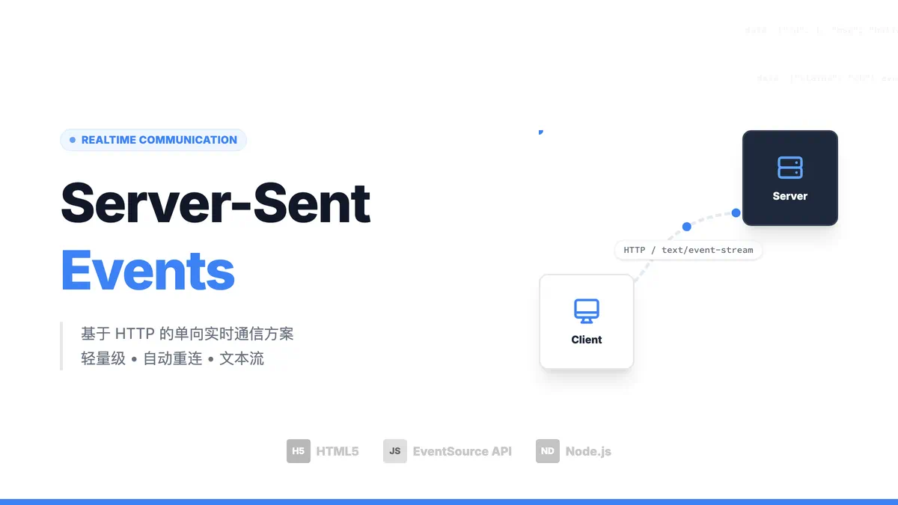

# SSE



SSE 与 WebSocket 作用相似，都是建立浏览器与服务器之间的通信渠道，然后服务器向浏览器推送信息。
总体来说，WebSocket 更强大和灵活。因为它是全双工通道，可以双向通信；SSE 是单向通道，只能服务器向浏览器发送，因为流信息本质上就是下载。如果浏览器向服务器发送信息，就变成了另一次 HTTP 请求。

#### 使用场景

SSE 特别适合以下场景：

1. 实时数据更新（股票价格、天气信息）
2. 社交媒体信息流
3. 实时通知系统
4. 日志实时显示
5. 进度条更新

#### 注意事项

1. 服务器需要支持长连接
2. 考虑设置适当的超时时间
3. 注意内存管理，及时清理不需要的连接
4. 考虑负载均衡的情况
5. 建议实现错误重试机制

#### 浏览器支持

SSE 在现代浏览器中得到广泛支持：

- Chrome 6+
- Firefox 6+
- Safari 5+
- Edge 79+
- Opera 11.5+

对于不支持的浏览器，可以使用 polyfill 库。

#### 客户端API

EventSource 是 SSE 的客户端 API，用于创建服务器发送事件的连接。

```javascript
const evtSource = new EventSource('http://your-server/events');
```

主要事件监听：

```javascript
// 连接成功时触发
evtSource.onopen = function() {
  console.log('连接已建立');
};

// 接收消息时触发
evtSource.onmessage = function(event) {
  const data = JSON.parse(event.data);
  console.log('收到数据：', data);
};

// 发生错误时触发
evtSource.onerror = function(err) {
  console.error('发生错误：', err);
};

// 监听自定义事件
evtSource.addEventListener('customEvent', function(event) {
  console.log('自定义事件数据：', event.data);
});

// 关闭连接
evtSource.close();
```

#### 服务器端实现

Node.js Express 示例：

```javascript
const express = require('express');
const app = express();

app.get('/events', (req, res) => {
  // 设置 SSE 所需的响应头
  res.setHeader('Content-Type', 'text/event-stream');
  res.setHeader('Cache-Control', 'no-cache');
  res.setHeader('Connection', 'keep-alive');

  // 发送数据
  const sendEvent = (data, eventType = null) => {
    if (eventType) {
      res.write(`event: ${eventType}\n`);
    }
    res.write(`data: ${JSON.stringify(data)}\n\n`);
  };

  // 定时发送数据示例
  const intervalId = setInterval(() => {
    sendEvent({ time: new Date().toISOString() });
  }, 1000);

  // 发送自定义事件
  sendEvent({ type: 'welcome' }, 'customEvent');

  // 客户端断开连接时清理
  req.on('close', () => {
    clearInterval(intervalId);
  });
});
```

#### 数据格式

服务器发送的消息格式：

每条消息以一个空行结束。可以包含以下字段：

- `event`: 事件类型（可选）
- `data`: 消息数据（必需）
- `id`: 消息ID（可选）
- `retry`: 重连时间（可选）

例如：

1. 基本消息：

```javascript
// 只发送数据
res.write('data: {"message": "Hello World"}\n\n');
```

2. 带事件类型的消息：

```javascript
// 发送带自定义事件类型的消息
res.write('event: userLogin\n');
res.write('data: {"userId": "123", "username": "张三"}\n\n');
```

3. 完整格式示例：

```javascript
// 包含所有可选字段的完整消息
res.write('id: 1\n');
res.write('event: userUpdate\n');
res.write('retry: 10000\n');  // 重连间隔为10秒
res.write('data: {"userId": "123", "status": "online"}\n\n');
```

4. 多行数据：

```javascript
// 发送多行数据
res.write('event: article\n');
res.write('data: {\n');
res.write('data: "title": "SSE 教程",\n');
res.write('data: "content": "这是一个关于 SSE 的详细教程",\n');
res.write('data: "author": "张三"\n');
res.write('data: }\n\n');
```

5. 使用工具函数发送消息：

```javascript
function sendSSE(res, data, eventType = null, id = null, retry = null) {
  let message = '';
  
  // 添加ID
  if (id) {
    message += `id: ${id}\n`;
  }
  
  // 添加事件类型
  if (eventType) {
    message += `event: ${eventType}\n`;
  }
  
  // 添加重试时间
  if (retry) {
    message += `retry: ${retry}\n`;
  }
  
  // 添加数据
  message += `data: ${JSON.stringify(data)}\n\n`;
  
  res.write(message);
}

// 使用示例
sendSSE(res, 
  { status: "success", data: "更新完成" }, 
  "updateStatus", 
  "msg-001", 
  3000
);
```
