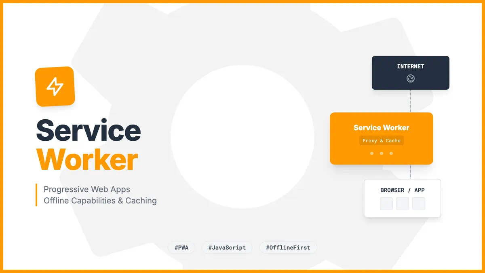

# Service Worker 介绍



## 什么是 Service Worker

Service Worker 是一种在浏览器背景中运行的脚本，它独立于网页运行，可以拦截和处理网络请求，包括以编程方式管理缓存资源。它是一种 JavaScript Worker，因此无法直接访问 DOM。

## 主要特性

- **离线工作能力**：可以完全控制应用在没有网络连接时的表现
- **网络请求代理**：可以拦截并修改网络请求，实现资源缓存策略
- **后台同步**：允许延迟操作直到网络连接恢复
- **推送通知**：让网站在用户未访问时推送通知
- **可编程的缓存**：精确控制缓存内容及其更新方式

## 生命周期

Service Worker 的生命周期包括：

1. **注册**：在页面中通过 JavaScript 注册 Service Worker
2. **安装**：当 Service Worker 脚本被下载并首次执行时
3. **激活**：安装成功后，Service Worker 被激活并控制页面
4. **空闲**：没有活动时进入空闲状态
5. **终止**：可能随时被浏览器终止以节省内存
6. **更新**：当发现新版本的 Service Worker 时

## 在项目中的应用

在本项目中，Service Worker 主要用于：

- 实现推送通知功能
- 处理后台消息接收
- 提供更好的离线体验

## 示例代码(客户端)

```ts
// 将base64字符串转换为Uint8Array
export function urlB64ToUint8Array(base64String: string) {
  const padding = "=".repeat((4 - (base64String.length % 4)) % 4);
  const base64 = (base64String + padding).replace(/-/g, "+").replace(/_/g, "/");

  const rawData = window.atob(base64);
  const outputArray = new Uint8Array(rawData.length);

  for (let i = 0; i < rawData.length; ++i) {
    outputArray[i] = rawData.charCodeAt(i);
  }
  return outputArray;
}

```

```javascript
// 注册 Service Worker
import { subscribeApi } from "@/api/system";
import { urlB64ToUint8Array } from "./utils";

const VAPID_PUBLIC_KEY =
  "BIzHIzpnq9Ytlu90jS67iZl_kEEwBhfdEAJcDJLBqCGxzQ_UD5aBvckVrCaHU-YZHdf48hcmc57ZyJCuTjJ28cE";

const swPath = `${import.meta.env.BASE_URL}sw.js`;

// 检查浏览器支持
if ("serviceWorker" in navigator && "PushManager" in window) {
  console.log("支持Service Worker和Push API");

  navigator.serviceWorker
    .register(swPath)
    .then(function (registration) {
      console.log("Service Worker注册成功:", registration);
    })
    .catch(function (error) {
      console.error("Service Worker注册失败:", error);
    });
} else {
  console.warn("不支持Push通知");
}

const getSubscription = async () => {
  const reg = await navigator.serviceWorker.ready;
  const subscription = await reg.pushManager.subscribe({
    userVisibleOnly: true,
    applicationServerKey: urlB64ToUint8Array(VAPID_PUBLIC_KEY), // 注意转为 Uint8Array
  });
  return subscription;
};

export const init = async () => {
  const subscription = await getSubscription();
  subscribeApi(subscription);
};

```

```js
// 处理推送事件
self.addEventListener("push", function(event) {
  console.log("[Service Worker] 收到推送");

  let notificationData = {};

  if (event.data) {
    try {
      notificationData = event.data.json();
    } catch (e) {
      notificationData = {
        title: "新消息",
        body: event.data.text()
      };
    }
  } else {
    notificationData = {
      title: "新消息",
      body: "您有一条新的通知"
    };
  }

  const title = notificationData.title || "新消息";
  const options = {
    body: notificationData.body || "您有一条新的通知",
    icon: notificationData.icon || "icon.png",
    data: notificationData.data || {},
    actions: notificationData.actions || [],
    vibrate: [100, 50, 100], // 振动模式
    timestamp: notificationData.timestamp || Date.now()
  };

  if ("waitUntil" in event && "registration" in self) {
    event.waitUntil(
      self.registration.showNotification(title, options)
    );
  }
});

```

## 示例代码(服务端 nest.js)

```ts
import { Inject, Injectable } from '@nestjs/common';
import {
  ServiceWorderSendMessageDto,
  ServiceWorderSubscribeDto,
} from './dto/system.dto';
import { CACHE_MANAGER } from '@nestjs/cache-manager';
import { RedisCache } from 'cache-manager-redis-yet';
import * as webpush from 'web-push';
import { ConfigService } from '@nestjs/config';
import { ServiceWorkerEnum } from 'types/config.enum';
@Injectable()
export class SystemService {
  constructor(
    private readonly configService: ConfigService,
    @Inject(CACHE_MANAGER) private cacheManager: RedisCache,
  ) {
    webpush.setVapidDetails(
      this.configService.get(ServiceWorkerEnum.SERVICE_WORKER_EMAIL) as string,
      this.configService.get(
        ServiceWorkerEnum.SERVICE_WORKER_PUBLIC_KEY,
      ) as string,
      this.configService.get(
        ServiceWorkerEnum.SERVICE_WORKER_PRIVATE_KEY,
      ) as string,
    );
  }

  // 订阅
  subscribe(body: ServiceWorderSubscribeDto) {
    const { endpoint } = body;
    // 存储到redies中
    this.cacheManager.set(
      `serviceWorder:${endpoint}`,
      body,
      1 * 24 * 60 * 60 * 1000,
    );
  }

  // 获取订阅
  async getSubscribe(endpoint: string) {
    // 从redies中取出数据
    const res = await this.cacheManager.get(`serviceWorder:${endpoint}`);
    return !!res;
  }

  // 取消订阅
  async cancelSubscribe(endpoint: string) {
    // 从redies中删除数据
    await this.cacheManager.del(`serviceWorder:${endpoint}`);
  }

  // 发送消息
  async sendMessage(body: ServiceWorderSendMessageDto) {
    const { payload, title } = body;
    const keys = await this.cacheManager.store.keys('serviceWorder:*');
    if (!keys) {
      return;
    }
    const subscriptions = (await this.cacheManager.store.mget(
      ...keys,
    )) as ServiceWorderSubscribeDto[];
    if (!subscriptions) {
      return;
    }
    for (const item of subscriptions) {
      const notificationPayload = {
        title,
        body: payload,
        data: { type: 'timer' },
      };

      webpush
        .sendNotification(item as any, JSON.stringify(notificationPayload), {
          timeout: 2000,
        })
        .then(() => {})
        .catch((err) => {
          console.log(err);
          this.cancelSubscribe(item.endpoint);
        });
    }
  }
}

```

## 浏览器兼容性

Service Worker 技术在现代浏览器中得到广泛支持，包括 Chrome、Firefox、Safari、Edge 等。但在使用前仍需检查兼容性以确保功能正常工作。

## 安全限制

- 只能在 HTTPS 环境或 localhost 下使用
- 无法直接访问 DOM
- 不能使用同步 XHR 和 localStorage

## 最佳实践

- 渐进式增强：优先提供基础功能，再用 Service Worker 增强体验
- 测试离线行为：确保离线模式下的可用性
- 谨慎处理缓存策略：避免过度缓存或缓存敏感数据
- 提供回退机制：确保在不支持 Service Worker 的环境中仍能正常运行
