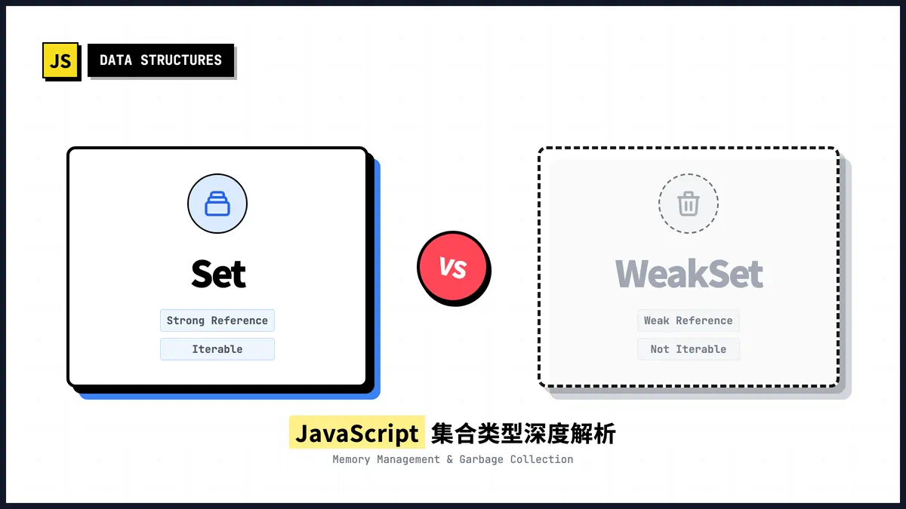

# WeakSet 和 Set 的区别



## Set 的特点

1. **存储内容**：Set 可以存储任何类型的值，包括原始数据类型（如字符串、数字）和对象类型

2. **唯一性**：Set 中的成员值都是唯一的，没有重复的值

3. **引用计数**：Set 对所存储的对象保持正常（强）引用，这意味着只要 Set 实例存在，其中存储的对象就不会被垃圾回收

4. **可迭代性**：Set 是可迭代的，可以使用 `for...of` 循环或 `forEach()` 方法遍历其中的元素

5. **方法**：Set 提供了 `add()`、`delete()`、`has()`、`clear()` 等操作方法，以及 `keys()`、`values()`、`entries()` 等遍历方法

6. **属性**：Set 有 `size` 属性，可以获取 Set 实例的成员总数

## WeakSet 的特点

1. **存储内容限制**：WeakSet 只能存储对象和非全局注册的符号，不能像 Set 那样存储任意类型的值

2. **弱引用**：WeakSet 对其中存储的对象保持弱引用，这意味着如果没有其他引用指向 WeakSet 中的对象，那么这些对象会被垃圾回收机制回收

3. **不可迭代**：由于弱引用的特性，WeakSet 是不可枚举的，没有 `size` 属性，也不能被遍历

4. **有限的方法**：WeakSet 只提供 `add()`、`delete()` 和 `has()` 方法

## 主要区别总结

1. **存储内容**：Set 可以存储任何类型的值，而 WeakSet 只能存储对象和非全局注册的符号

2. **引用方式**：Set 保持强引用，WeakSet 保持弱引用

3. **垃圾回收**：WeakSet 中的对象如果没有其他引用，会被垃圾回收；而 Set 中的对象即使没有其他引用，也不会被回收

4. **可迭代性**：Set 可以迭代，WeakSet 不可迭代

5. **属性和方法**：Set 有 `size` 属性和更多的方法，WeakSet 没有 `size` 属性且方法有限

## 使用场景

- **Set**：适合需要存储唯一值集合并需要遍历或获取集合大小的场景

- **WeakSet**：适合临时存储对象引用且不影响垃圾回收的场景，例如：
    - 检测循环引用
    - 存储与对象绑定的信息，当对象被回收时，相关信息也会自动消失

## 什么是非全局注册的符号

### Symbol 基础知识

在 JavaScript 中，Symbol 是一种原始数据类型，它表示一个唯一的、不可变的值。Symbol 主要用于创建对象的唯一属性键，以避免属性名冲突。

### Symbol 的两种创建方式

JavaScript 中的 Symbol 可以通过两种主要方式创建：

#### 1. 非全局注册的符号 (Symbol())

使用 `Symbol()` 函数直接创建的符号是**非全局注册的符号**。这种符号具有以下特点：

- 每次调用 `Symbol()` 都会创建一个全新的、唯一的符号，即使描述相同
- 这些符号不会被存储在全局符号注册表中
- 它们是完全私有的，只能通过最初创建它们的变量引用访问
- 即使描述相同，两个非全局符号也永远不会相等：`Symbol("foo") === Symbol("foo")` 的结果是 `false`

```javascript
// 创建非全局注册的符号
const sym1 = Symbol();
const sym2 = Symbol("描述");
const sym3 = Symbol("描述");

console.log(sym2 === sym3); // false，即使描述相同
```

#### 2. 全局注册的符号 (Symbol.for())

使用 `Symbol.for()` 方法创建的符号是**全局注册的符号**。这种符号具有以下特点：

- 它们会被存储在一个全局符号注册表中
- 如果使用相同的键调用 `Symbol.for()`，将返回同一个符号
- 全局符号可以在不同的代码部分、甚至不同的 realm（如 iframe）之间共享

```javascript
// 创建全局注册的符号
const globalSym1 = Symbol.for("全局键");
const globalSym2 = Symbol.for("全局键");

console.log(globalSym1 === globalSym2); // true，因为它们引用同一个全局符号
```

### 与 WeakSet 的关系

WeakSet 可以存储非全局注册的符号（通过 `Symbol()` 创建的符号）作为其成员，因为这些符号是可被垃圾回收的值。而全局注册的符号（通过 `Symbol.for()` 创建的符号）则不能被存储在 WeakSet 中，因为它们不是可垃圾回收的。

### 总结

- **非全局注册的符号**：通过 `Symbol()` 创建，每次创建都是唯一的，不存储在全局注册表中，可以被垃圾回收。
- **全局注册的符号**：通过 `Symbol.for()` 创建，存储在全局符号注册表中，相同键的多次调用返回同一个符号，不可被垃圾回收。
