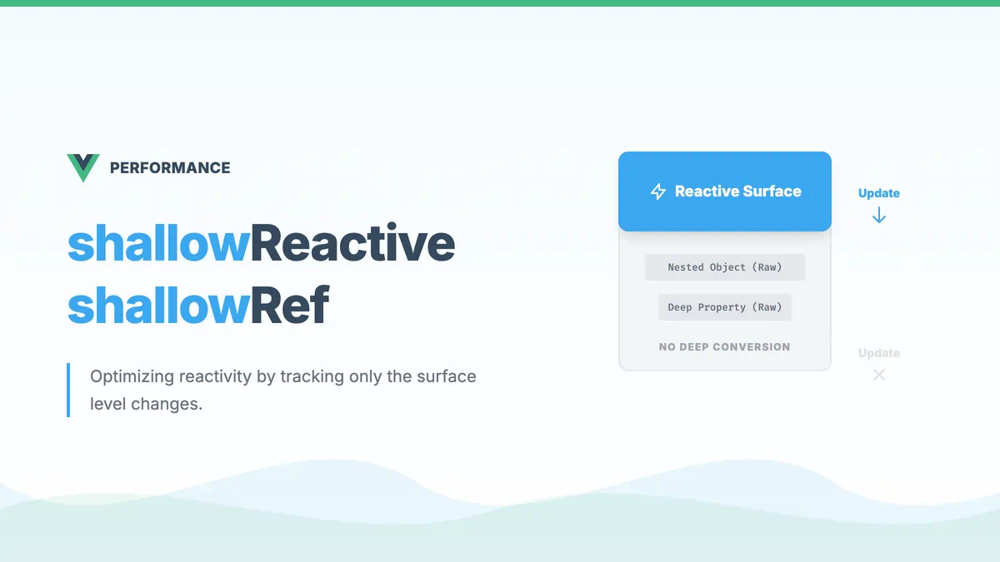

# Vue3 中的 shallowReactive 和 shallowRef



## 一、基本概念

### shallowReactive

- 创建一个响应式代理，它跟踪其自身属性的响应性，但不执行嵌套对象的深层响应式转换
- 只有对象的第一层属性是响应式的
- 对嵌套对象的修改不会触发更新

### shallowRef

- 创建一个跟踪自身 `.value` 变化的 ref，但不会使其值也变成响应式的
- 只有对 `.value` 的直接替换会触发更新
- 对 `.value` 对象内部属性的修改不会触发更新

## 二、与 reactive 和 ref 的区别

### 1. reactive vs shallowReactive

```javascript
import { reactive, shallowReactive } from "vue";

// reactive - 深层响应式
const deep = reactive({
  user: {
    name: "张三",
    age: 25,
  },
});

// 修改嵌套属性会触发更新
deep.user.name = "李四"; // ✅ 触发更新

// shallowReactive - 浅层响应式
const shallow = shallowReactive({
  user: {
    name: "张三",
    age: 25,
  },
});

// 修改第一层属性会触发更新
shallow.user = { name: "李四", age: 26 }; // ✅ 触发更新
// 修改嵌套属性不会触发更新
shallow.user.name = "王五"; // ❌ 不会触发更新
```

### 2. ref vs shallowRef

```javascript
import { ref, shallowRef } from "vue";

// ref - 深层响应式
const deep = ref({
  count: 0,
  user: {
    name: "张三",
  },
});

// 修改嵌套属性会触发更新
deep.value.user.name = "李四"; // ✅ 触发更新

// shallowRef - 浅层响应式
const shallow = shallowRef({
  count: 0,
  user: {
    name: "张三",
  },
});

// 替换整个 value 会触发更新
shallow.value = { count: 1, user: { name: "李四" } }; // ✅ 触发更新
// 修改内部属性不会触发更新
shallow.value.count = 2; // ❌ 不会触发更新
shallow.value.user.name = "王五"; // ❌ 不会触发更新
```

## 三、实际应用场景

### 1. shallowReactive 的使用场景

```javascript
// 1. 大型数据结构，只需要跟踪最外层变化
const state = shallowReactive({
  list: generateHugeList(), // 大量数据
  status: "loading",
});

// 只跟踪 status 的变化
state.status = "loaded"; // 触发更新
state.list[0].name = "new name"; // 不触发更新

// 2. 外部库集成，避免不必要的深层代理
const thirdPartyState = shallowReactive({
  libraryInstance: new ThirdPartyLibrary(),
  config: {
    // 配置项
  },
});

// 3. 性能优化，当只需要跟踪顶层属性时
const uiState = shallowReactive({
  isOpen: false,
  data: {
    // 大量嵌套数据
  },
});
```

### 2. shallowRef 的使用场景

```javascript
// 1. 处理大型数据结构
const bigData = shallowRef({
  // 大量数据
  items: generateHugeList(),
  metadata: {
    timestamp: Date.now(),
  },
});

// 2. 外部状态集成
const externalState = shallowRef(getInitialState());

// 3. DOM 引用
const elementRef = shallowRef(null);
onMounted(() => {
  elementRef.value = document.querySelector("#app");
});
```
