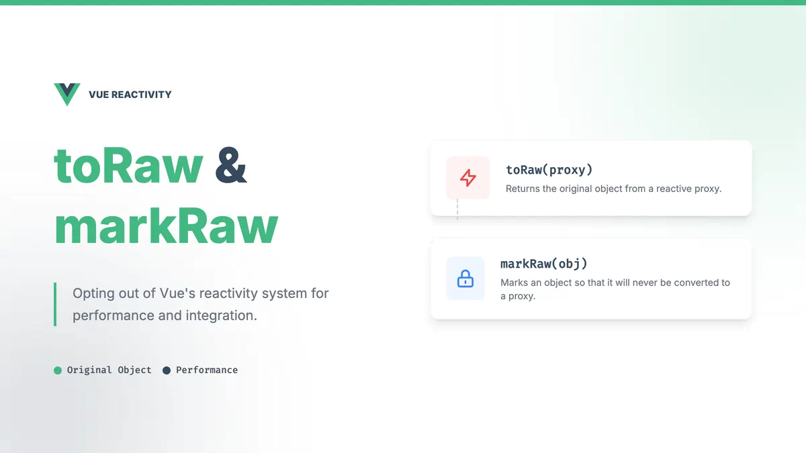

# Vue3 中的 toRaw 和 markRaw



## 一、基本概念

### toRaw

- 返回响应式对象的原始对象
- 可用于临时读取而不触发追踪
- 可用于写入而不触发更改
- 不会深层递归转换

### markRaw

- 标记一个对象永远不会转换为响应式对象
- 返回对象本身
- 嵌套的对象也不会变成响应式
- 用于优化性能

## 二、基本用法

### 1. toRaw 的使用

```javascript
import { reactive, toRaw } from "vue";

const state = reactive({
  count: 0,
  user: {
    name: "张三",
    age: 25,
  },
});

// 获取原始对象
const raw = toRaw(state);

// 修改原始对象不会触发更新
raw.count++; // 不会触发视图更新
raw.user.name = "李四"; // 不会触发视图更新

// 但修改响应式对象会触发更新
state.count++; // 会触发视图更新
```

### 2. markRaw 的使用

```javascript
import { reactive, markRaw } from "vue";

// 标记一个对象永远不会成为响应式
const rawObject = markRaw({
  name: "张三",
  nested: {
    count: 0,
  },
});

// 即使包装到 reactive 中也不会变成响应式
const state = reactive({
  rawData: rawObject,
});

// 这些修改都不会触发更新
state.rawData.name = "李四";
state.rawData.nested.count++;
```

## 三、实际应用场景

### 1. toRaw 的使用场景

```javascript
// 1. 性能优化，临时退出响应式系统
const state = reactive({
  largeData: {
    // 大量数据
  },
});

function processingData() {
  // 使用原始对象处理数据，避免触发响应式更新
  const rawData = toRaw(state.largeData);
  // 处理数据...

  // 处理完后再赋值回响应式对象
  state.largeData = rawData;
}

// 2. 与外部库集成
const thirdPartyLib = {
  process: (data) => {
    // 第三方库可能不需要响应式对象
  },
};

// 传递原始对象给第三方库
thirdPartyLib.process(toRaw(state));
```

### 2. markRaw 的使用场景

```javascript
// 1. 不需要响应式的大型对象
const bigObject = markRaw({
  // 大量数据或复杂对象
  data: new Array(10000).fill(0),
});

// 2. 第三方库实例
const thirdPartyInstance = markRaw(new ThirdPartyClass());

// 3. DOM 元素引用
const domElement = markRaw(document.querySelector("#app"));

// 4. 工具函数或类
class Helper {
  // 一些辅助方法
}
const helper = markRaw(new Helper());
```

## 四、注意事项

### 1. toRaw 注意点

```javascript
// 1. 不会深层转换
const state = reactive({
  count: 0,
  nested: reactive({ value: 1 }),
});

const rawObj = toRaw(reactiveObj);
// 深层对象不会被转换, nested 仍然是 reactive 对象
console.log(rawObj);

// 2. 修改原始对象不会触发更新
const state = reactive({
  count: 0,
  nested: {
    value: 1,
  },
});

const raw = toRaw(state);
raw.count++; // 不会触发更新
state.count++; // 会触发更新
```

### 2. markRaw 注意点

```javascript
const rawObject = markRaw({
  value: 1,
  nested: {
    count: 0,
  },
});

// 1. 标记是永久性的
const state = reactive({
  data: rawObject,
});
state.data.value++; // 不会触发更新

// 2. 嵌套对象也不会是响应式的
state.data.nested.count++; // 不会触发更新

// 3. 不影响已经存在的响应式对象
const existingReactive = reactive({ count: 0 });
const mixed = markRaw({ reactive: existingReactive });
mixed.reactive.count++; // 仍然是响应式的
```
