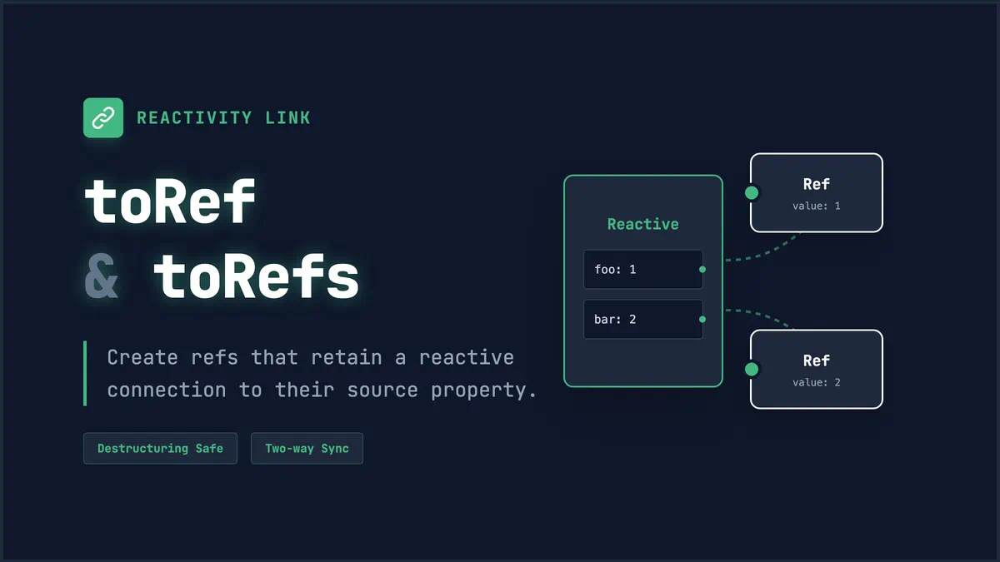

# Vue3 中的 toRef 和 toRefs



## 一、基本概念

### toRef

- 用于将一个响应式对象的属性转换为单个 ref
- 创建一个 ref，与源属性保持引用关系
- 即使源属性不存在，也会返回一个可用的 ref

### toRefs

- 将一个响应式对象的所有属性转换为 ref 对象
- 常用于响应式对象的解构
- 返回一个普通对象，其中每个属性都是指向源对象相应属性的 ref

## 二、基本用法

### 1. toRef 的使用

```javascript
import { reactive, toRef } from "vue";

const state = reactive({
  foo: 1,
  bar: 2,
});

// 创建一个 ref，引用 state.foo
const fooRef = toRef(state, "foo");

// 更改 ref 会更新源属性
fooRef.value++;
console.log(state.foo); // 2

// 更改源属性也会更新 ref
state.foo++;
console.log(fooRef.value); // 3

// 即使属性不存在也可以使用 toRef
const notExistRef = toRef(state, "notExist");
console.log(notExistRef.value); // undefined
```

### 2. toRefs 的使用

```javascript
import { reactive, toRefs } from "vue";

const state = reactive({
  foo: 1,
  bar: 2,
});

// 将整个响应式对象的所有属性转换为 ref
const stateRefs = toRefs(state);

// 可以解构，且保持响应性
const { foo, bar } = stateRefs;

console.log(foo.value); // 1
console.log(bar.value); // 2

// 更改 ref 会更新源属性
foo.value++;
console.log(state.foo); // 2

// 更改源属性也会更新 ref
state.bar++;
console.log(bar.value); // 3
```

## 三、实际应用场景

### 1. 使用 toRef 的场景

```javascript
// 1. 为可选属性创建 ref
const state = reactive({});
const nameRef = toRef(state, "name"); // 即使属性不存在也不会报错

// 2. 传递单个属性的引用
const props = defineProps(["title"]);
const titleRef = toRef(props, "title");
// 即使 props 更新，titleRef 也会更新

// 3. 创建计算属性的简单替代
const state = reactive({ firstName: "John", lastName: "Doe" });
const fullNameRef = toRef(state, "firstName");
```

### 2. 使用 toRefs 的场景

```javascript
// 1. 组合式函数中返回响应式对象
function useFeature() {
  const state = reactive({
    foo: 1,
    bar: 2,
  });

  // 其他逻辑...

  // 返回时转换为 refs，这样解构不会丢失响应性
  return toRefs(state);
}

// 使用时可以解构
const { foo, bar } = useFeature();

// 2. 解构 props 时保持响应性
const props = defineProps(["title", "content"]);
const { title, content } = toRefs(props);
```

## 四、toRef 和 toRefs 的实现原理

### 1. toRef 的完整实现

```javascript
// toRef 的实现
function toRef(object, key) {
  const wrapper = {
    get value() {
      track(wrapper, "value"); // 收集依赖
      return object[key];
    },
    set value(newValue) {
      const oldValue = object[key];
      object[key] = newValue;
      if (oldValue !== newValue) {
        trigger(wrapper, "value"); // 触发更新
      }
    },
  };
  return wrapper;
}

// 创建副作用函数
function effect(fn) {
  activeEffect = fn;
  fn(); // 立即执行一次以收集依赖
  activeEffect = null;
}

// 使用示例
const state = reactive({
  name: "张三",
});

const nameRef = toRef(state, "name");

effect(() => {
  console.log("name changed:", nameRef.value);
});

nameRef.value = "李四"; // 会触发更新
```

### 2. toRefs 的完整实现

```javascript
function toRefs(object) {
  const refs = {};

  // 遍历对象的每个属性
  for (const key in object) {
    refs[key] = toRef(object, key);
  }

  return refs;
}

// 使用示例
const state = reactive({
  name: "张三",
  age: 25,
});

const stateRefs = toRefs(state);

effect(() => {
  console.log("name changed:", stateRefs.name.value);
});

effect(() => {
  console.log("age changed:", stateRefs.age.value);
});

stateRefs.name.value = "李四"; // 会触发 name 相关的更新
stateRefs.age.value = 26; // 会触发 age 相关的更新
```
