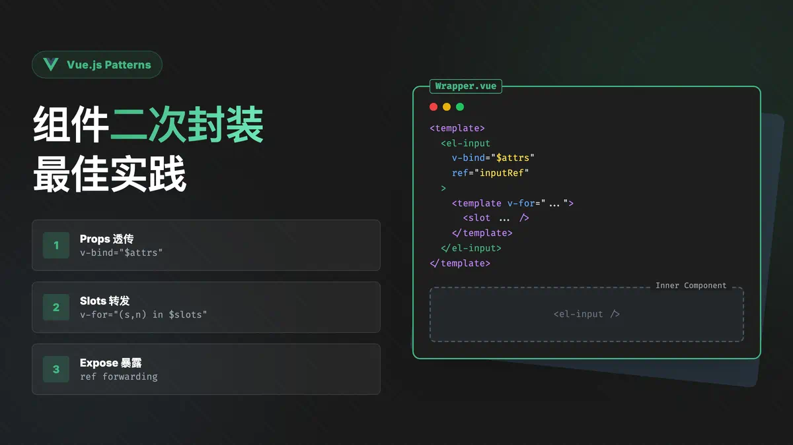

# 组件二次封装



组件二次封装应该考虑一下3点

1. props如何穿透过去
2. 插槽如何穿透过去
3. 组件的方法如何暴露

### 1.props如何穿透过去

通过 `$attrs`
在 Vue 3 中，` $attrs` 是一个非常重要的特性，它包含了父组件传递给子组件的所有属性，这些属性没有被子组件声明为 props 或 emits 的自定义事件。简单来说， $attrs 包含了「透传属性」。

```ts
<template>
  <el-input v-bind="{ ...props, ...$attrs }" />
</template>

<script setup lang="ts">
import { InputProps } from "element-plus";
// 为了能有更好的ts类型提示
const props = defineProps<Partial<InputProps>>();
</script>
```

### 2.插槽如何穿透过去

#### 方法一 插槽通过 `$slots` 来获取，然后遍历`$slots`

```ts
<template>
  <el-input v-bind="{ ...props, ...$attrs }">
    <template v-for="(index, name) in $slots" v-slot:[name]>
      <slot :name="name" />
    </template>
  </el-input>
</template>
```

#### 方法二 通过component组件和h函数

 h函数可以用来动态创建组件，它的第一个参数是组件的标签名，第二个参数是组件的属性，第三个参数是组件的插槽，第四个参数是组件的内容

```ts
<template>
  <component
    :is="h(ElInput, { ...$attrs, ...props, ref: getRefInstance }, $slots)"
  />
</template>
```

### 3. 组件的方法如何暴露

通过 ref 来获取组件实例，然后通过 exposed 来暴露组件的方法

```ts
<template>
  <component
    :is="h(ElInput, { ...$attrs, ...props, ref: getRefInstance }, $slots)"
  />
</template>

<script setup lang="ts">
import { ElInput, InputInstance, InputProps } from "element-plus";
import { getCurrentInstance, h } from "vue";

const props = defineProps<Partial<InputProps>>();
const vm = getCurrentInstance();
const getRefInstance = (inputInstance: InputInstance) => {
  vm.exposed = inputInstance || {};
  vm.exposeProxy = inputInstance || {};
};
</script>
```
