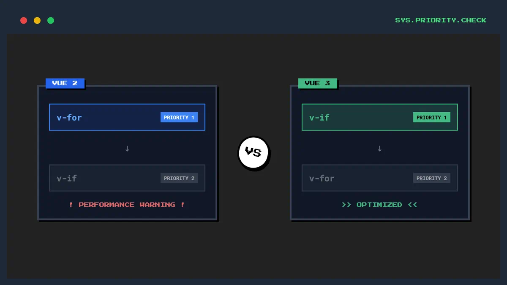

# Vue2 和 Vue3 中 v-if 和 v-for 的区别



## 一、优先级差异

### Vue2

- 在 Vue2 中，`v-for` 的优先级高于 `v-if`
- 当它们同时存在于一个元素上时，`v-for` 会先执行，然后再执行 `v-if`
- 这可能会导致性能问题，因为即使被 `v-if` 过滤掉的项也会被 `v-for` 遍历

```vue
<!-- Vue2 中的示例 -->
<template>
  <!-- 不推荐：v-for 和 v-if 一起使用 -->
  <ul>
    <li v-for="user in users" v-if="user.isActive" :key="user.id">
      {{ user.name }}
    </li>
  </ul>
</template>
```

相当于伪代码

```js
users.map((user) => {
  if (user.isActive) {
    return user.name;
  }
});
```

### Vue3

- 在 Vue3 中，`v-if` 的优先级高于 `v-for`
- 当它们同时存在时，`v-if` 会先执行
- 这意味着 `v-if` 无法访问 `v-for` 作用域内的变量
- Vue3 的这种改变提高了性能和代码的可维护性

```vue
<!-- Vue3 中的示例 -->
<template>
  <!-- 这种写法在 Vue3 中会报错 -->
  <ul>
    <li v-for="user in users" v-if="user.isActive" :key="user.id">
      {{ user.name }}
    </li>
  </ul>
</template>
```

相当于伪代码

```js
// 这里会报错，因为由于作用域问题， user 是无法被访问的
if (user.isActive) {
  users.map((user) => {
    return user.name;
  });
}
```

## 二、最佳实践

### Vue2 推荐写法

```vue
<template>
  <!-- 推荐：使用计算属性过滤数据 -->
  <ul>
    <li v-for="user in activeUsers" :key="user.id">
      {{ user.name }}
    </li>
  </ul>
</template>

<script>
export default {
  computed: {
    activeUsers() {
      return this.users.filter((user) => user.isActive);
    },
  },
};
</script>
```

### Vue3 推荐写法

```vue
<template>
  <!-- 方法1：使用计算属性（推荐） -->
  <ul>
    <li v-for="user in activeUsers" :key="user.id">
      {{ user.name }}
    </li>
  </ul>

  <!-- 方法2：将 v-if 移到容器元素上 -->
  <template v-if="shouldShowUsers">
    <ul>
      <li v-for="user in users" :key="user.id">
        {{ user.name }}
      </li>
    </ul>
  </template>
</template>

<script setup>
import { computed } from "vue";

const activeUsers = computed(() => {
  return users.value.filter((user) => user.isActive);
});
</script>
```