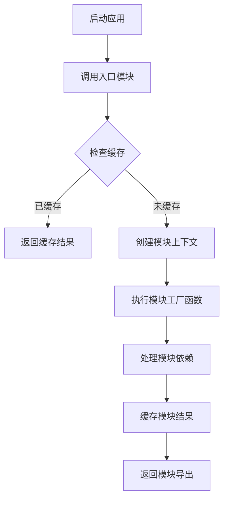

# webpack 自定义模块加载器

这是一个简化版的 webpack 模块加载器实现，通过模拟 webpack 的核心机制来帮助理解现代模块打包工具的工作原理。

## 项目概述

本项目实现了一个迷你版的模块加载系统，包含：

- 模块依赖管理
- 缓存机制
- CommonJS 规范支持

## 功能特性

- **模块缓存**: 实现了模块缓存机制，避免重复加载同一模块
- **依赖解析**: 支持模块间的依赖关系解析
- **CommonJS 兼容**: 模拟 CommonJS 的 `module.exports` 和 `require` 语法

## 核心实现原理

### 1. 整体架构

```javascript
(function(modules) {
  // 模块缓存
  const moduleCache = new Map();
  
  // 模块加载器
  const _webpack_require = (moduleId) => { /* ... */ };
  
  // 启动入口模块
  _webpack_require("./src/index.js");
})({ /* 模块映射表 */ });
```

### 2. 模块加载器函数

```javascript
const _webpack_require = (moduleId) => {
  // 检查缓存
  if (moduleCache.has(moduleId)) {
    return moduleCache.get(moduleId);
  }

  // 创建新模块上下文
  const module = { exports: {} };
  
  // 获取模块工厂函数并执行
  const moduleFn = modules[moduleId];
  moduleFn(module, module.exports, _webpack_require);
  
  // 缓存模块结果
  moduleCache.set(moduleId, module.exports);
  return module.exports;
};
```

### 3. 关键组件解析

| 组件 | 作用 | 说明 |
|------|------|------|
| `moduleCache` | 模块缓存 | 使用 Map 存储已加载模块，提高性能 |
| `modules` | 模块注册表 | 存储所有模块的工厂函数 |
| `module.exports` | 模块导出 | 每个模块的导出对象 |
| `_webpack_require` | 模块加载器 | 核心加载函数，处理依赖解析 |

## 工作流程



1. **初始化阶段**: 创建模块缓存 Map 和加载器函数
2. **模块注册**: 将所有模块以工厂函数形式注册到 modules 对象
3. **依赖解析**: 模块调用 require 时，递归加载所需依赖
4. **缓存管理**: 首次加载后将结果缓存，避免重复执行
5. **执行完成**: 从入口模块开始，逐步构建完整的依赖图

## 示例代码分析

```js
(function modules(modules) {
  // 用于缓存模块
  const moduleCache = new Map();

  // 用于加载模块
  const _webpack_require = (moduleId) => {
    if (moduleCache.has(moduleId)) {
      return moduleCache.get(moduleId);
    }

    // 创建模块
    const module = {
      exports: {},
    };
    const moduleFn = modules[moduleId];
    moduleFn(module, module.exports, _webpack_require);
    const moduleResult = module.exports;

    // 缓存模块
    moduleCache.set(moduleId, moduleResult);
    return moduleResult;
  };

  // 加载入口模块
  _webpack_require("./src/index.js");
})({
  "./src/index.js": function (module, exports, require) {
    const { add } = require("./src/util.js");
    console.log(add(1, 2));
  },
  "./src/util.js": function (module, exports, require) {
    const add = (a, b) => a + b;
    module.exports = { add };
  },
});

```
