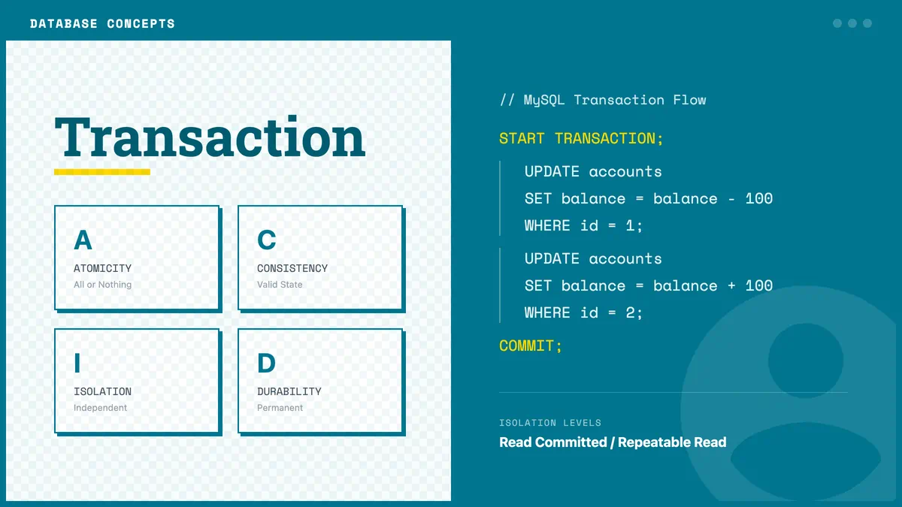

# MySQL事务



## 事务的概念

事务是一组操作的集合，它是一个不可分割的工作单位。事务会把所有的操作作为一个整体一起向系统提交或撤销操作请求，即这些操作要么同时成功，要么同时失败。

## 事务的特性（ACID）

事务必须满足4个条件（ACID）：

1. **原子性（Atomicity）**：事务中的所有操作要么全部完成，要么全部不完成，不会结束在中间某个环节。事务在执行过程中发生错误，会被回滚到事务开始前的状态，就像这个事务从来没有执行过一样。

2. **一致性（Consistency）**：在事务开始之前和事务结束以后，数据库的完整性没有被破坏。这表示写入的资料必须完全符合所有的预设规则，这包含资料的精确度、串联性以及后续数据库可以自发性地完成预定的工作。

3. **隔离性（Isolation）**：数据库允许多个并发事务同时对其数据进行读写和修改的能力，隔离性可以防止多个事务并发执行时由于交叉执行而导致数据的不一致。事务隔离分为不同级别，包括读未提交（Read uncommitted）、读提交（Read committed）、可重复读（Repeatable read）和串行化（Serializable）。

4. **持久性（Durability）**：事务处理结束后，对数据的修改就是永久的，即便系统故障也不会丢失。

## MySQL中的事务操作

### 自动提交模式

在MySQL中，默认情况下是自动提交的，每一条SQL语句都会自动提交。可以通过以下命令查看和设置自动提交模式：

```sql
# 查看自动提交模式
SELECT @@autocommit;

# 设置自动提交模式（1为开启，0为关闭）
SET autocommit = 1; # 或 SET autocommit = 0;
```

### 手动事务控制

当需要将多个操作作为一个事务处理时，可以使用以下命令：

```sql
# 开始事务
START TRANSACTION; # 或 BEGIN;

# 执行SQL操作
...

# 提交事务
COMMIT;

# 回滚事务
ROLLBACK;
```

### 事务的实际应用示例

以下是一个转账的例子，演示了事务的使用：

```sql
# 进入study数据库
use study;

# 创建用户表
create table sw_user (
    id int PRIMARY KEY AUTO_INCREMENT,
    username VARCHAR(20),
    money DOUBLE
);

# 插入数据
insert into sw_user(username, money) values('张三', 2000);
insert into sw_user(username, money) values('李四', 2000);

# 将事务改为手动提交
SET autocommit = 1;

# 开始事务
START TRANSACTION;

# 查询张三的账户
SELECT * FROM sw_user WHERE username = '张三';

# 张三转账1000给李四
UPDATE sw_user SET money = money - 1000 WHERE username = '张三';
UPDATE sw_user SET money = money + 1000 WHERE username = '李四';

# 提交事务
COMMIT;

# 如果出现问题，可以回滚事务
# ROLLBACK;
```

## 事务隔离级别

事务隔离级别定义了一个事务可能受其他并发事务影响的程度。MySQL支持以下四种隔离级别：

1. **读未提交（READ UNCOMMITTED）**：最低的隔离级别，一个事务可以读取另一个未提交事务的数据。

2. **读提交（READ COMMITTED）**：一个事务只能读取另一个已提交事务的数据。

3. **可重复读（REPEATABLE READ）**：MySQL的默认隔离级别，确保同一事务的多个实例在并发读取数据时，会看到同样的数据行。

4. **串行化（SERIALIZABLE）**：最高的隔离级别，完全服从ACID的隔离级别，确保事务可以从一个表中读取相同的行。在这个级别，查询语句会在读取的每一行数据上都加锁，所以可能导致大量的超时和锁竞争问题。

### 查看和设置隔离级别

```sql
# 查看当前会话隔离级别
SELECT @@transaction_isolation;

# 设置当前会话隔离级别
SET SESSION TRANSACTION ISOLATION LEVEL READ UNCOMMITTED;
SET SESSION TRANSACTION ISOLATION LEVEL READ COMMITTED;
SET SESSION TRANSACTION ISOLATION LEVEL REPEATABLE READ;
SET SESSION TRANSACTION ISOLATION LEVEL SERIALIZABLE;

# 设置全局隔离级别
SET GLOBAL TRANSACTION ISOLATION LEVEL READ UNCOMMITTED;
SET GLOBAL TRANSACTION ISOLATION LEVEL READ COMMITTED;
SET GLOBAL TRANSACTION ISOLATION LEVEL REPEATABLE READ;
SET GLOBAL TRANSACTION ISOLATION LEVEL SERIALIZABLE;
```

## 事务中的问题

在并发事务处理中可能会出现以下问题：

### 1. 脏读（Dirty Read）

**定义**：一个事务读取了另一个事务未提交的数据。

**例子**：

假设有两个事务A和B同时在运行：

```sql
-- 事务A
START TRANSACTION;
UPDATE sw_user SET money = money - 1000 WHERE username = '张三';
-- 此时事务A还未提交

-- 事务B
START TRANSACTION;
-- 事务B读取了事务A未提交的数据
SELECT * FROM sw_user WHERE username = '张三';
-- 此时事务B会看到张三的余额已经减少了1000元

-- 如果事务A此时回滚
ROLLBACK;

-- 那么事务B中读取到的数据就是错误的，这就是脏读
```

### 2. 不可重复读（Non-repeatable Read）

**定义**：在一个事务内多次读取同一数据集合，由于其他事务在这个事务执行期间修改了数据并提交，导致两次读取的数据不一致。

**例子**：

```sql
-- 事务A
START TRANSACTION;
-- 第一次读取张三的账户余额
SELECT money FROM sw_user WHERE username = '张三';
-- 此时查询结果为2000元

-- 事务B（同时进行）
START TRANSACTION;
UPDATE sw_user SET money = money - 500 WHERE username = '张三';
COMMIT;

-- 事务A继续执行，再次读取张三的账户余额
SELECT money FROM sw_user WHERE username = '张三';
-- 此时查询结果为1500元，与第一次读取的结果不一致
-- 这就是不可重复读问题
```

### 3. 幻读（Phantom Read）

**定义**：在一个事务内多次查询某个符合查询条件的记录数量，由于其他事务在这个事务执行期间插入了符合条件的新记录，导致查询结果数量不一致。

**例子**：

```sql
-- 事务A
START TRANSACTION;
-- 查询余额大于1000元的用户
SELECT * FROM sw_user WHERE money > 1000;
-- 假设此时只有两条记录（张三和李四）

-- 事务B（同时进行）
START TRANSACTION;
INSERT INTO sw_user(username, money) VALUES('王五', 3000);
COMMIT;

-- 事务A继续执行，再次查询余额大于1000元的用户
SELECT * FROM sw_user WHERE money > 1000;
-- 此时查询结果有三条记录（张三、李四和王五）
-- 这就是幻读问题，仿佛出现了"幻影"记录
```

不同的隔离级别可以解决不同的问题：

| 隔离级别 | 脏读 | 不可重复读 | 幻读 |
| --- | --- | --- | --- |
| 读未提交（READ UNCOMMITTED） | 可能 | 可能 | 可能 |
| 读提交（READ COMMITTED） | 不可能 | 可能 | 可能 |
| 可重复读（REPEATABLE READ） | 不可能 | 不可能 | 可能 |
| 串行化（SERIALIZABLE） | 不可能 | 不可能 | 不可能 |

## 总结

事务是数据库操作的基本单位，正确使用事务可以保证数据的一致性和完整性。在实际应用中，应根据业务需求选择合适的事务隔离级别，平衡数据一致性和系统性能。
