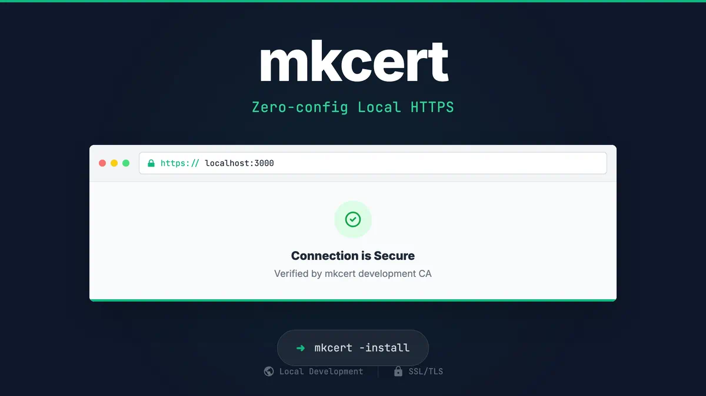

# 使用 mkcert 进行本地 HTTPS 开发



## mkcert 是什么？

`mkcert` 是一个简单的零配置工具，用于制作本地受信任的开发证书。它对于在本地计算机上开发和测试需要安全（HTTPS）环境的 Web 应用程序非常有用。

## 为什么使用它？

许多现代 Web API 和功能（如 Service Workers、WebRTC 等）需要安全上下文才能运行。虽然您可以手动创建自签名证书，但浏览器会显示安全警告，因为它们不信任这些证书。`mkcert` 通过创建本地证书颁发机构（CA）并将其安装到您系统的信任库中来解决此问题。这使得您用它生成的任何证书在本地浏览器中都是“受信任的”，从而消除了安全警告。

## 安装

### macOS

使用 [Homebrew](https://brew.sh/):

```bash
brew install mkcert
# 如果你使用 Firefox，你还需要安装 nss
brew install nss
```

### Windows

使用 [Chocolatey](https://chocolatey.org/):

```bash
choco install mkcert
```

或者使用 [Scoop](https://scoop.sh/):

```bash
scoop bucket add extras
scoop install mkcert
```

### Linux

你需要安装 `certutil`。

```bash
# 在 Debian/Ubuntu 上
sudo apt install libnss3-tools

# 在 Fedora/RHEL 上
sudo yum install nss-tools

# 在 Arch Linux 上
sudo pacman -S nss
```

然后你可以从源代码安装 `mkcert` 或使用预构建的二进制文件。有关详细说明，请访问 [mkcert 官方 GitHub 仓库](https://github.com/FiloSottile/mkcert)。

## 如何使用

### 1. 安装本地 CA

首先，你需要运行安装命令。这将创建并安装你的本地证书颁发机构。每台机器只需执行一次。

```bash
mkcert -install
```

系统可能会提示您输入密码。

### 2. 生成证书

导航到你的项目根目录，并为你需要的域生成证书。对于本地开发，通常是 `localhost` 和 `127.0.0.1`。

```bash
mkcert localhost 127.0.0.1
```

此命令将在当前目录中创建两个文件：

- `localhost+1.pem` (证书文件)
- `localhost+1-key.pem` (私钥文件)

### 3. (可选) 将证书文件添加到 `.gitignore`

一个好的做法是防止将这些证书文件提交到版本控制中。将以下行添加到你的 `.gitignore` 文件中：

```
# 本地证书
*.pem
```

## 与 Vite 集成

要将生成的 SSL 证书与 Vite 开发服务器一起使用，你需要在 `vite.config.ts` 中配置 `server.https` 选项。

1. 确保已如上所述在项目根目录中生成了证书文件。

2. 修改你的 `vite.config.ts` 以读取这些文件：

    ```ts
    import { defineConfig } from "vite";
    import vue from "@vitejs/plugin-vue";
    import fs from "fs";
    import path from "path";

    // https://vitejs.dev/config/
    export default defineConfig({
      plugins: [vue()],
      server: {
        host: "0.0.0.0", // 监听所有地址
        https: {
          key: fs.readFileSync(path.resolve(__dirname, "localhost+1-key.pem")),
          cert: fs.readFileSync(path.resolve(__dirname, "localhost+1.pem"))
        }
      }
    });
    ```

3. 现在，当你启动开发服务器时（例如 `pnpm dev`），它将可以通过 `https://localhost:5173`（或你配置的端口）访问，并且你的浏览器将信任该连接。
