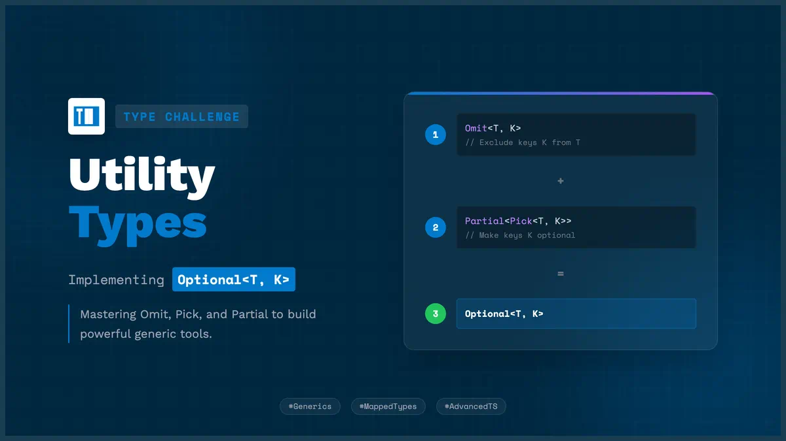

# 实现一个类型工具 Optional<T, K>



Optional<T, K> 将 T 中的 K 属性设置为可选
```ts
/**
 * 实现一个类型工具 Optional<T, K> 将 T 中的 K 属性设置为可选
 * 1. Omit 从 T 中排出 K
 * 2. Pick 从 T 中挑选 K
 * 3. Partial 将 T 中的所有属性设置为可选
 */
type Optional<T, K extends keyof T> = Omit<T, K> & Partial<Pick<T, K>>;

//  验证
interface Article {
  title: string;
  content: string;
  author: string;
  data: Date;
  readCount: number;
}
const createArticle = (options: Optional<Article, "data" | "author">) => {
  console.log(options);
};

createArticle({
  title: "Hello",
  content: "World",
  readCount: 0,
});
```