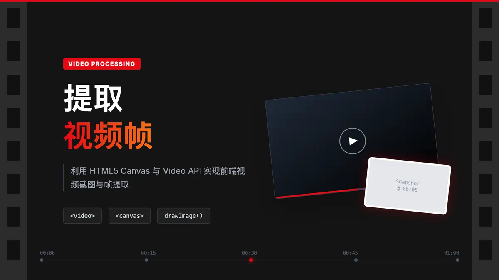

# 提取视频帧 - 前端视频处理技术



## 📖 简介

在前端开发中，有时我们需要从视频中提取特定帧作为图片使用。本文将详细介绍如何使用 **HTML5 Canvas** 技术实现视频帧的提取，这是一种纯前端的解决方案，无需服务端支持。

---

## 🎯 应用场景

视频帧提取技术在实际开发中有广泛的应用：

| 场景 | 描述 |
|------|------|
| **视频封面生成** | 自动从视频中提取某一帧作为封面缩略图 |
| **视频预览** | 生成视频时间轴上的预览缩略图条 |
| **视频编辑器** | 实现帧级别的视频编辑功能 |
| **内容审核** | 提取关键帧用于内容合规检查 |
| **视频转 GIF** | 提取多帧合成 GIF 动画 |

---

## 🔧 核心技术原理

### 技术栈

- **HTML5 Video**: 用于加载和播放视频文件
- **Canvas 2D API**: 用于捕获视频画面并转换为图片
- **Blob API**: 用于处理二进制数据和生成可用的图片 URL

### 实现流程

```
┌─────────────────┐    ┌─────────────────┐    ┌─────────────────┐
│   上传视频文件   │ -> │ 创建 Video 元素  │ -> │  设置播放时间    │
└─────────────────┘    └─────────────────┘    └─────────────────┘
                                                      │
                                                      v
┌─────────────────┐    ┌─────────────────┐    ┌─────────────────┐
│   返回图片 URL  │ <- │ Canvas 转 Blob  │ <- │ Canvas 绘制帧   │
└─────────────────┘    └─────────────────┘    └─────────────────┘
```

### 关键技术点

1. **`URL.createObjectURL()`**: 将 File 对象转换为可被 video 元素加载的临时 URL
2. **`video.currentTime`**: 设置视频播放位置，精确定位到目标帧
3. **`ctx.drawImage()`**: 将当前视频帧绘制到 Canvas 上
4. **`canvas.toBlob()`**: 将 Canvas 内容异步转换为 Blob 对象

---

## 💻 完整实现代码

```html
<!DOCTYPE html>
<html lang="zh-CN">
  <head>
    <meta charset="UTF-8" />
    <meta name="viewport" content="width=device-width, initial-scale=1.0" />
    <title>视频帧提取器</title>
    <style>
      body {
        font-family: -apple-system, BlinkMacSystemFont, 'Segoe UI', Roboto, sans-serif;
        padding: 20px;
        background: #f5f5f5;
      }
      .container {
        max-width: 1200px;
        margin: 0 auto;
      }
      .upload-area {
        border: 2px dashed #ccc;
        border-radius: 8px;
        padding: 40px;
        text-align: center;
        background: white;
        margin-bottom: 20px;
      }
      .frames-container {
        display: grid;
        grid-template-columns: repeat(auto-fill, minmax(150px, 1fr));
        gap: 10px;
      }
      .frames-container img {
        width: 100%;
        border-radius: 4px;
        box-shadow: 0 2px 4px rgba(0,0,0,0.1);
      }
    </style>
  </head>
  <body>
    <div class="container">
      <h1>🎬 视频帧提取器</h1>
      <div class="upload-area">
        <input type="file" accept="video/*" id="videoInput" />
        <p>选择一个视频文件来提取帧</p>
      </div>
      <div class="frames-container" id="framesContainer"></div>
    </div>

    <script>
      /**
       * 从视频文件中提取指定时间点的帧
       * @param {File} file - 视频文件对象
       * @param {number} time - 要提取的时间点（秒）
       * @param {string} format - 输出图片格式，默认 'image/jpeg'
       * @param {number} quality - 图片质量 0-1，默认 0.8
       * @returns {Promise<{url: string, width: number, height: number}>}
       */
      const captureFrame = (file, time, format = 'image/jpeg', quality = 0.8) => {
        return new Promise((resolve, reject) => {
          // 1. 创建视频文件的临时 URL
          const url = URL.createObjectURL(file);
          
          // 2. 创建 video 元素
          const video = document.createElement("video");
          
          // 3. 配置视频属性
          // 注意：浏览器安全策略要求静音才能自动播放
          video.muted = true;
          video.autoplay = true;
          // 允许跨域（如果视频来自外部源）
          video.crossOrigin = "anonymous";
          // 预加载元数据
          video.preload = "metadata";
          
          // 4. 设置视频源
          video.src = url;
          
          // 5. 错误处理
          video.onerror = () => {
            URL.revokeObjectURL(url);
            reject(new Error('视频加载失败'));
          };
          
          // 6. 当视频元数据加载完成后设置时间
          video.onloadedmetadata = () => {
            // 确保请求的时间不超过视频总时长
            video.currentTime = Math.min(time, video.duration);
          };
          
          // 7. 当视频可以播放时（帧已准备好）
          video.oncanplay = () => {
            try {
              // 创建 Canvas 元素
              const canvas = document.createElement("canvas");
              const ctx = canvas.getContext("2d");
              
              // 设置 Canvas 尺寸与视频一致
              canvas.width = video.videoWidth;
              canvas.height = video.videoHeight;
              
              // 将当前视频帧绘制到 Canvas
              ctx.drawImage(video, 0, 0, canvas.width, canvas.height);
              
              // 将 Canvas 转换为 Blob
              canvas.toBlob(
                (blob) => {
                  if (blob) {
                    // 释放之前的视频 URL
                    URL.revokeObjectURL(url);
                    
                    // 返回结果
                    resolve({
                      url: URL.createObjectURL(blob),
                      width: canvas.width,
                      height: canvas.height,
                      time: time,
                      size: blob.size
                    });
                  } else {
                    reject(new Error('Canvas 转换失败'));
                  }
                },
                format,
                quality
              );
            } catch (error) {
              reject(error);
            }
          };
        });
      };

      /**
       * 批量提取视频帧
       * @param {File} file - 视频文件
       * @param {number} count - 要提取的帧数
       * @param {number} interval - 帧间隔（秒）
       */
      const captureMultipleFrames = async (file, count = 10, interval = 1) => {
        const frames = [];
        for (let i = 0; i < count; i++) {
          try {
            const frame = await captureFrame(file, i * interval);
            frames.push(frame);
          } catch (error) {
            console.warn(`帧 ${i} 提取失败:`, error);
          }
        }
        return frames;
      };

      // 页面交互逻辑
      const inputElement = document.getElementById("videoInput");
      const framesContainer = document.getElementById("framesContainer");

      inputElement.addEventListener("change", async (e) => {
        const file = e.target.files[0];
        if (!file) return;
        
        // 清空之前的帧
        framesContainer.innerHTML = '<p>正在提取帧...</p>';
        
        try {
          // 提取前 20 帧，每秒一帧
          const frames = await captureMultipleFrames(file, 20, 1);
          
          // 清空加载提示
          framesContainer.innerHTML = '';
          
          // 显示提取的帧
          frames.forEach((frame, index) => {
            const img = document.createElement("img");
            img.src = frame.url;
            img.title = `第 ${frame.time} 秒 - ${frame.width}x${frame.height}`;
            framesContainer.appendChild(img);
          });
        } catch (error) {
          framesContainer.innerHTML = `<p style="color: red;">提取失败: ${error.message}</p>`;
        }
      });
    </script>
  </body>
</html>
```

---

## ⚠️ 注意事项

### 1. 浏览器兼容性

| 浏览器 | 支持情况 |
|--------|---------|
| Chrome | ✅ 完全支持 |
| Firefox | ✅ 完全支持 |
| Safari | ⚠️ 部分视频格式可能不支持 |
| Edge | ✅ 完全支持 |
| IE | ❌ 不支持 |

### 2. 视频格式支持

浏览器对视频格式的支持取决于其内置的视频解码器：

- **MP4 (H.264)**: 所有现代浏览器都支持
- **WebM (VP8/VP9)**: Chrome、Firefox 支持较好
- **MOV**: 主要在 Safari 中支持良好

### 3. 性能考虑

- 大文件处理时可能会占用较多内存
- 建议使用 Web Worker 进行异步处理
- 及时调用 `URL.revokeObjectURL()` 释放内存

### 4. 安全限制

- 跨域视频需要服务器配置 CORS 头
- 本地文件需要通过 `<input type="file">` 上传

---

## 🚀 性能优化建议

### 1. 使用 Web Worker

将帧提取逻辑放到 Web Worker 中执行，避免阻塞主线程：

```javascript
// 在 Web Worker 中使用 OffscreenCanvas
const offscreen = new OffscreenCanvas(width, height);
const ctx = offscreen.getContext('2d');
```

### 2. 节流与防抖

当需要实时预览时，使用节流控制提取频率：

```javascript
const throttle = (fn, delay) => {
  let lastCall = 0;
  return (...args) => {
    const now = Date.now();
    if (now - lastCall >= delay) {
      lastCall = now;
      return fn(...args);
    }
  };
};
```

### 3. 图片压缩

使用 `toBlob` 的 quality 参数控制输出大小：

```javascript
canvas.toBlob(callback, 'image/jpeg', 0.6); // 60% 质量
```

---

## 📚 相关 API 参考

- [HTMLVideoElement](https://developer.mozilla.org/zh-CN/docs/Web/API/HTMLVideoElement)
- [Canvas API](https://developer.mozilla.org/zh-CN/docs/Web/API/Canvas_API)
- [URL.createObjectURL()](https://developer.mozilla.org/zh-CN/docs/Web/API/URL/createObjectURL)
- [Blob](https://developer.mozilla.org/zh-CN/docs/Web/API/Blob)

---

## 🎉 总结

通过本文，我们学习了如何使用 HTML5 Canvas 技术从视频中提取帧。这种方法的优点是：

1. **纯前端实现**：无需服务端支持
2. **灵活性高**：可以精确控制提取时间点
3. **兼容性好**：适用于所有现代浏览器

希望本文对你有所帮助！如有问题，欢迎交流讨论。
