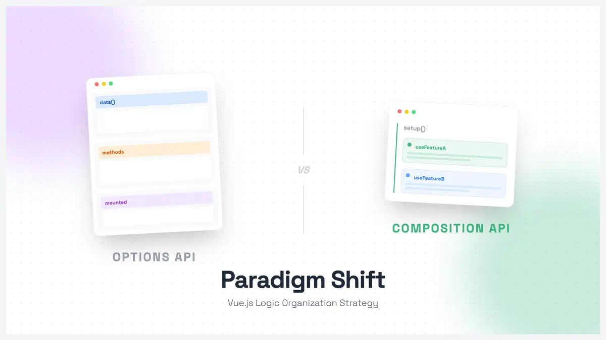

# Vue 组合式 API 和选项式 API 的区别



## 一、基本概念

### 选项式 API（Options API）

- 使用 `data`、`methods`、`computed` 等选项来组织代码
- Vue2 的传统写法，Vue3 继续支持
- 通过 `this` 访问组件实例

### 组合式 API（Composition API）

- Vue3 新增的特性
- 使用 `setup` 函数组织代码
- 提供更好的代码复用和组织能力

## 二、代码组织方式对比

### 1. 选项式 API 示例

```javascript
export default {
  // 数据
  data() {
    return {
      user: {
        name: "张三",
        age: 25,
      },
      loading: false,
    };
  },

  // 计算属性
  computed: {
    userInfo() {
      return `${this.user.name}今年${this.user.age}岁`;
    },
  },

  // 方法
  methods: {
    updateUser() {
      this.loading = true;
      // 更新逻辑
      this.loading = false;
    },
  },

  // 生命周期
  mounted() {
    console.log("组件挂载完成");
  },
};
```

### 2. 组合式 API 示例

```javascript
import { ref, reactive, computed, onMounted } from "vue";

export default {
  setup() {
    // 数据
    const user = reactive({
      name: "张三",
      age: 25,
    });
    const loading = ref(false);

    // 计算属性
    const userInfo = computed(() => {
      return `${user.name}今年${user.age}岁`;
    });

    // 方法
    const updateUser = () => {
      loading.value = true;
      // 更新逻辑
      loading.value = false;
    };

    // 生命周期
    onMounted(() => {
      console.log("组件挂载完成");
    });

    // 返回需要给模板使用的数据和方法
    return {
      user,
      loading,
      userInfo,
      updateUser,
    };
  },
};
```

## 三、主要区别

### 1. 代码组织

- 选项式 API：
  - 按选项类型组织代码（data、methods、computed 等）
  - 相关功能的代码可能分散在不同选项中
- 组合式 API：
  - 可以按功能逻辑组织代码
  - 相关功能的代码可以放在一起

### 2. 代码复用

- 选项式 API：
  - 主要通过 mixins 实现
  - 容易产生命名冲突
  - 来源不清晰
- 组合式 API：
  - 通过组合函数（composables）实现
  - 更清晰的数据来源
  - 更好的类型推导

### 3. TypeScript 支持

- 选项式 API：
  - 需要额外的类型声明
  - 类型推导相对较弱
- 组合式 API：
  - 天然支持 TypeScript
  - 更好的类型推导体验

## 四、实际应用示例

### 1. 功能复用 - 选项式 API（使用 mixin）

```javascript
// userMixin.js
export const userMixin = {
  data() {
    return {
      user: {
        name: "",
        age: 0,
      },
    };
  },
  methods: {
    updateUser() {
      // 更新逻辑
    },
  },
};

// 组件中使用
export default {
  mixins: [userMixin],
  mounted() {
    console.log(this.user);
  },
};
```

### 2. 功能复用 - 组合式 API（使用组合函数）

```javascript
// useUser.js
import { reactive } from "vue";

export function useUser() {
  const user = reactive({
    name: "",
    age: 0,
  });

  const updateUser = () => {
    // 更新逻辑
  };

  return {
    user,
    updateUser,
  };
}

// 组件中使用
import { useUser } from "./useUser";

export default {
  setup() {
    const { user, updateUser } = useUser();

    return {
      user,
      updateUser,
    };
  },
};
```
