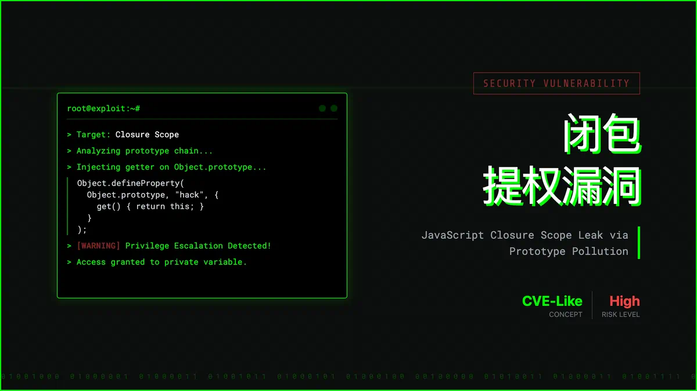

# 闭包的提权漏洞



如何在不改变上面代码的情况下 修改obj的name属性
```ts
var o = (function () {
  const obj = {
    name: "张三",
  };
  return {
    get: function (key: string) {
      return obj[key];
    },
  };
})();
```
#### 解题思路
1. 通过valueOf方法获取对象(不可取)
```ts
const obj = o.get('valueOf')
// obj这时为一个函数，但是作用域为window，因此不可取
```
2. 给Object的原型添加一个方法，方法返回值为this（这个对象)

```ts
var o = (function () {
  const obj = {
    name: "张三",
  };
  return {
    get: function (key: keyof typeof obj) {
      return obj[key];
    },
  };
})();

// 如何在不改变上面代码的情况下 修改obj的name属性
Object.defineProperty(Object.prototype, "hack", {
  get() {
    return this;
  },
});

const obj = Object.hack();
obj.name = "李四";
console.log(o.get("name"));
```
#### 防止手段
给obj的原型设置为null
1. 通过Object.create(null)
```ts
var o = (function () {
  const obj = Object.create(null);
  obj.name = "张三";
  return {
    get: function (key: string) {
      return obj[key];
    },
  };
})();
```
2. 通过 Object.setPrototypeOf
```ts
var o = (function () {
  const obj = {
    name: "张三",
  };
  Object.setPrototypeOf(obj, null);
  return {
    get: function (key: string) {
      return obj[key];
    },
  };
})();
```